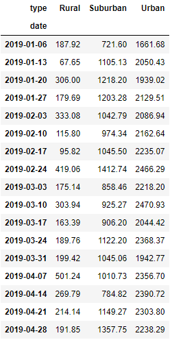
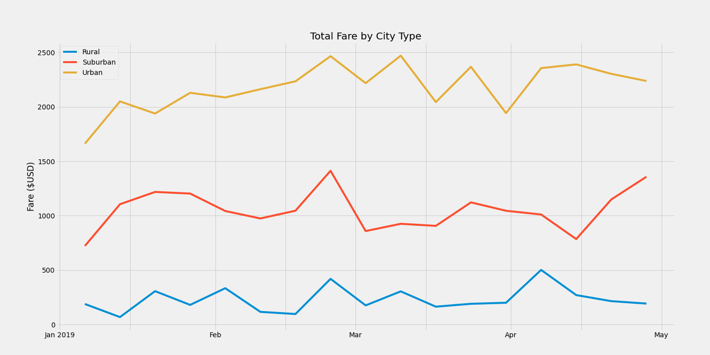

# Challenge 5, Deliverable 3: PyBer Analysis
## Overview of the analysis
#### Purpose
The purpose of this analysis is to find the relationship between the different variables, and how each variable can have an affect on ride data per city type, in order to help the decision-makers at  the company we work at, PyBer. Our CEO, V. Isualize, has given our friend and co-worker Omar and I a new assignment - create a summary DataFrame of the ride-sharing data by city type and create a multiple-line graph that shows the total weekly fares for each city type.

## Results
#### Summary DataFrame
To showcase the differences between the types of cities, the first thing that we did was to create a new DataFrame (DF) by grouping the data together by the city type, from using the initial merged DF. Here is a snippet of the initial merged DF:


Here we can see that there are six different columns: "city", "date", "fare", "ride_id", "driver_count", and "type". To make the Summary DF according to the challenge, we need to find some certain statistics, which we can do by using Pandas methods. We need to find the total amount of rides, and we need to group all of the data by city type. The code would look like this:

`total_rides_by_type = pyber_data_df.groupby(["type"]).count()["ride_id"]`

`pyber_data_df` is the merged DF. I use the `.groupby()` function with the `["type"]` argument to group all the data in the DF by the type column. I then chain the `.count()['ride_id]` method on the end to give me the counts of all items under the `["ride_id"]` column grouped by the type of city. I then use similar formulas, I could calculate the total amount of drivers by city type, total fare amounts by city type, average fare per ride by city type, and average fare per driver by city type. I saved each of these calculations in their own variables to be able to add them to the newly created Summary DF. Here is the code that I used:

```
pyber_summary_df = pd.DataFrame({
    "Total Rides": total_rides_by_type,
    "Total Drivers": total_drivers_by_type,
    "Total Fares": total_fares_by_type,
    "Average Fare per Ride": avg_fare_per_ride_by_type,
    "Average Fare per Driver": avg_fare_per_driver_by_type
})
```

Here is a photo of the Summary DF that was created:


Here, we can see that there are three different types of cities: Urban, Suburban, and Rural. From these stats, we were able to create a few other DFs. One such DF is the `weekly_cut_chron_pyber_data`. The process for creating the DF was a bit lengthy. To simplify, we created a new DF from `pyber_data_df` by grouping by `["type","date"]` and using  `.sum()["fare"]`. This groups all rows in the table by the city type and the date, putting the date in chronological order. We then reset the index to split all the data into their own seperate columns. We create a pivot table using the `pivot()` function on the index-reset DF. This pivot table now shows every instance of a ride, the ride's fare data, by city type, and in chronological order. From here, we can limit the data to only show from `2019-01-01:2019-04-29` as per the challenege instructions. We can also put the rides into weekly bins, which will give us the sum of ride fare (in USD) earned over 7 days for each city type. This latest DF is labeled as `weekly_cut_chron_pyber_data.png`. Here is an image of it:



From here, we can create a line graph figure which holds the three columns of weekly data. Here is an image of the graph:



Let's get to the main analysis.

Before explaining how the differences between the three different types of cities can be attributed to multiple factors, let's look at and explain what is going on in the graph:
- the Urban city type has the highest total fare amount earned per week,
- the Suburban city type has the second highest,
- and the Rural city type has the third highest amount.

In every category (unsurprisingly), the ranked performance of each city type is:
1. Urban
2. Suburban
3. Rural

Let's explain how each factor affects city type performance: 
- There is likely a larger audience for this service in an Urban setting where there are more people, which is why there are more total rides for the Urban type. 
- Since there are more rides being paid for in this city type, there also need to be more people _offering the service_, which accounts for the drastically higher number of total drivers. 
- More people buying into the service will drive costs down, which can explain why the average fare is the lowest for the Urban city type. 
- Since there are a high number of drivers, the collective pool of fare money to be made is split among more people, meaning that each driver earns less than they would in the other city types. 
- Following this logic for the other two city types explains their performance.

## Summary
#### Conclusion
In conclusion, the Urban city type is by far the most profitable city type for PyBer. It would make sense to allocate the majority of resources there. But the other two settings should not be ignored either. Here are three recommendations to the CEO, V. Isualize, that I think could help bring in more profits:
1. __Lower the cost of fare per ride in rural areas__. While there is only a fraction of the audience in this city type, some customers may refuse the service because the average cost of the fare is so high. There are too many drivers who are making a nice sum of money compared to the riders who either cannot afford it or do not want to pay as much for one.
2. __Find the reason for and capitalize on the collective spike in total fare right before March__. According to the Total Fare by City Type line graph, each city type saw a spike in revenue made from rides given before March started. Since this graph only shows up to May, it may be worth looking into the rest of the year's data and finding high points of activity.
3. __Reward riders in Urban areas__. According to the data, the Urban area is the most profitable compared to the Suburban area and the Rural area. Keeping customers means keeping money flowing in. Offer incentives for Urban inhabitants to use the service over other means of transportation.
