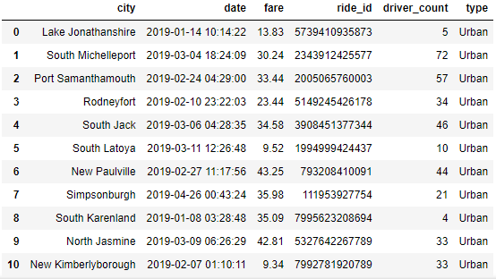

# Module 5, Deliverable 5: PyBer Analysis
## Overview of the analysis
#### Purpose
The purpose of this analysis is to find the relationship between the type of city and the total fares in $USD earned per week, in order to help the decision-makers at  the company we work at, PyBer. Our CEO, V. Isualize, has given our friend and co-worker Omar and I a new assignment - create a summary DataFrame of the ride-sharing data by city type and create a multiple-line graph that shows the total weekly fares for each city type. 

## Results
#### Summary DataFrame
To showcase the differences between the types of cities, the first thing that we did was to create a new DataFrame (DF) by grouping the data together by the city type, from using the initial merged DF. Here is a snippet of the initial DF:

Here is a photo of the Summary DF that was created:

Here, we can see that there are three different types of cities: Urban, Suburban, and Rural. Using the original data that was provided, I was able to find the 
